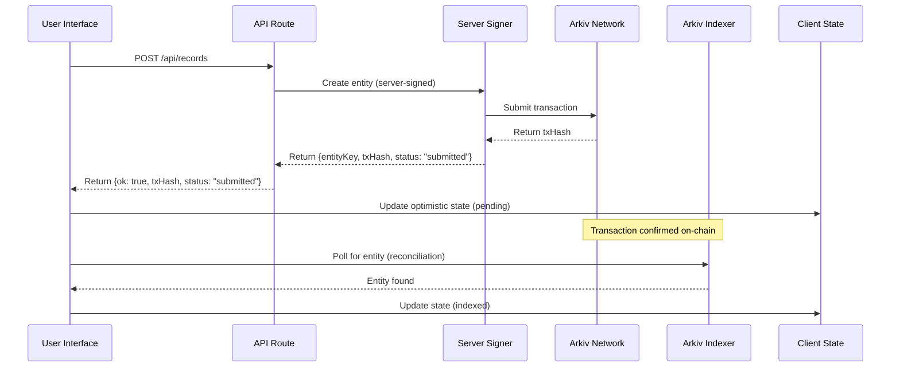

# Arkiv Next.js Starter

**Purpose:** Starter template for building Arkiv applications with Next.js.

**Status:** Available in `extractions/arkiv-nextjs-starter/` (will be published as standalone repo)

**Target Audience:** Developers building Arkiv applications who want a complete, working example with Next.js App Router.

---

## What This Template Does

The Arkiv Next.js Starter is a complete, minimal template that demonstrates how to build Arkiv applications with Next.js. It fills the gap between "SDK sample script" and "real app" by providing a working example with read paths, write paths, optimistic UI, and error handling.

**Key Capabilities:**

1. **Read path** - Querying Arkiv entities via `createPublicClient` + query builder
2. **Write path** - Server-signed writes via Next.js API routes (Phase 0)
3. **Optimistic UI** - Handling "submitted vs indexed" states gracefully
4. **Error handling** - Timeout, rate limit, and network error classification
5. **Testnet-native** - Mendoza testnet defaults with local node support for CI

**What It Is Not:**

- Not a full-featured application (minimal working example)
- Not a replacement for learning Arkiv fundamentals (complements learn-arkiv)
- Not opinionated about UI frameworks (uses Tailwind CSS for styling)
- Not a production-ready app (template for building your own)

---

## Template Structure

When published as a standalone GitHub repo, the structure will be:

```
arkiv-nextjs-starter/
├── app/
│   ├── api/records/route.ts    # Server-signed write endpoint
│   ├── records/
│   │   ├── page.tsx            # List records
│   │   ├── [id]/page.tsx       # Record details
│   │   └── new/page.tsx        # Create record
│   └── layout.tsx
├── src/lib/arkiv/
│   ├── client.ts               # Uses app-kit
│   ├── queries.ts              # Uses app-kit
│   └── writes.ts               # Uses app-kit
├── scripts/
│   ├── seed.ts                 # Create demo records
│   └── smoke-test.ts           # Minimal read/write test
├── docs/
│   ├── patterns-used.md         # Patterns demonstrated
│   └── failure-modes.md        # Common issues and solutions
├── .env.example
├── README.md
└── package.json
```

---

## End-to-End Mental Model

This template demonstrates the complete flow from user action to indexed state:



**Key points:**
- **Server signer** handles all writes (Phase 0)
- **Optimistic UI** shows "submitted" immediately
- **Reconciliation** polls indexer until entity appears
- **Indexer lag** is normal - UI represents it as a state, not an error

---

## Quick Start

1. **Install dependencies:**
   ```bash
   npm install
   ```

2. **Set up environment variables:**
   ```bash
   cp .env.example .env
   # Edit .env and set:
   # - SPACE_ID (required, no fallback)
   # - ARKIV_PRIVATE_KEY (required for writes)
   # - ARKIV_TARGET (optional: 'local' or 'mendoza', default: 'mendoza')
   ```

3. **Run development server:**
   ```bash
   npm run dev
   ```

4. **Seed demo data:**
   ```bash
   npm run seed
   ```

5. **Run smoke test:**
   ```bash
   npm run test:smoke
   ```

---

## Arkiv App Kit Integration

This template uses [Arkiv App Kit](./arkiv-app-primitives.md) via **copy-in** approach (simplest for templates).

The app-kit is located at `../arkiv-app-kit/` relative to this template.

**To use in your own project:**
- **Workspace monorepo:** Add `arkiv-app-kit` as a workspace package
- **Git submodule:** Add as a git submodule
- **Copy-in:** Copy `src/` directory into your project

See [Arkiv App Kit](./arkiv-app-primitives.md) for distribution strategies.

### Update Policy

This template uses **copy-in** for app-kit by default. To pull improvements:

1. **Check for updates:** Review `../arkiv-app-kit/` for changes
2. **Copy updated files:** Copy changed files from `arkiv-app-kit/src/` to `src/lib/arkiv/`
3. **Test:** Run `npm run build` and `npm run test:smoke` to verify compatibility
4. **Commit:** Document which app-kit changes were incorporated

**Alternative:** Switch to workspace monorepo or git submodule for easier updates (see [Arkiv App Kit](./arkiv-app-primitives.md) for setup).

---

## Measurable Proof

**Fork, deploy, and query your data from a second client without migrating DB credentials.**

**Proof steps:**
1. Fork this template and deploy to separate environment (both on Mendoza testnet)
2. Use same `SPACE_ID` (testnet/devrel-scoped) and Mendoza RPC endpoint
3. Query records created by first deployment
4. Verify records are independently queryable (no shared DB connection)
5. **Verify on explorer:** Click txHash link, confirm transaction visible on Mendoza explorer
6. **Testnet validation:** Both deployments read same records from same testnet space

---

## Testnet Ops Reality

**Server signer wallet must be funded** (or writes will fail/timeout).

**How to derive signer address:**
```bash
ARKIV_PRIVATE_KEY=0x... node ../arkiv-ai-agent-kit/scripts/derive-signer-address.mjs
```

**Faucet behavior:**
- Manual only (no automation)
- Fund the signer address shown above

**What failures look like when signer is empty:**
- Timeouts (transaction never submitted)
- Transaction replacement errors (nonce issues)
- Rate limit errors (if retrying)

**How to distinguish "indexer lag" from "tx never landed":**
- Indexer lag: Transaction hash exists, explorer shows tx, but query returns empty
- Tx never landed: No transaction hash, explorer shows nothing, API returns error

---

## Patterns Demonstrated

This template demonstrates the following patterns:

- **PAT-QUERY-001:** Indexer-Friendly Query Shapes
- **PAT-TIMEOUT-001:** Transaction Timeouts
- **PAT-ERROR-001:** Error Handling
- **PAT-OPTIMISTIC-001:** Optimistic UI + Reconciliation
- **PAT-SPACE-001:** Space ID as Environment Boundary
- **PAT-IDENTITY-001:** Wallet Normalization

See [Arkiv Patterns Catalog](../arkiv-patterns-catalog.md) for comprehensive pattern documentation.

---

## Common Failure Modes

See `docs/failure-modes.md` in the template for detailed information on:
- Timeouts
- Indexer lag
- Wallet casing issues
- SpaceId mismatches
- Transaction replacement errors
- Rate limit errors

---

## Mainnet Migration Checklist (Non-Operational)

This section is intentionally non-operational (checklist, not instructions) to avoid divergence before Arkiv team finalizes mainnet guidance.

- [ ] Update RPC endpoint to mainnet
- [ ] Update `SPACE_ID` to production space
- [ ] Verify signer wallet is funded on mainnet
- [ ] Update explorer links to mainnet explorer
- [ ] Review gas costs and transaction fees
- [ ] Test all write paths on mainnet
- [ ] Verify indexer performance on mainnet
- [ ] Update documentation with mainnet-specific guidance

---

## Builder Mode (Multi-Space)

If you need to query across multiple spaces:

- Arkiv doesn't support OR queries across `spaceId`
- Strategy: Query broadly by `type` with safe limit, then filter client-side by allowed spaceIds
- See [Arkiv App Kit](./arkiv-app-primitives.md) for `queryMultipleSpaces()` helper

---

## Related Documentation

- [Arkiv Patterns Catalog](../arkiv-patterns-catalog.md) - Comprehensive pattern documentation
- [Top 8 Patterns](../top-8-patterns.md) - Essential patterns demonstrated in templates
- [Engineering Guidelines](../../../ENGINEERING_GUIDELINES.md) - Complete engineering standards
- [Arkiv App Kit](./arkiv-app-primitives.md) - Shared core package used by this template
- [AI Agent Kit](./ai-agent-kit.md) - LLM context for building Arkiv integrations

---

**Last Updated:** 2025-12-30  
**Status:** Complete and ready for publication

