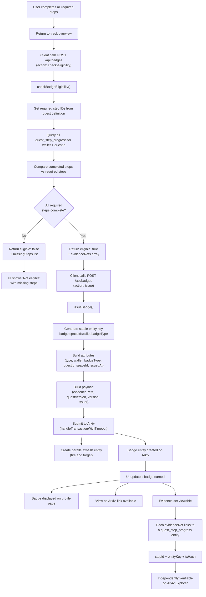

# Badge Issuance Flow

## Overview

This document describes how a Proof of Skill badge is checked for eligibility, issued to Arkiv, and rendered on the user's profile. Badges are wallet-tied, verifiable on-chain credentials that prove quest track completion.

## Flow Diagram

## Prerequisite Checks

Before a badge can be issued, `checkBadgeEligibility()` verifies:

1. **Required steps identified**: loads the quest definition and extracts step IDs where `required: true`
2. **Progress queried**: fetches all `quest_step_progress` entities for the wallet + questId
3. **Completion checked**: every required step must have a corresponding progress entity
4. **Evidence collected**: builds an `evidenceRefs` array with `{ stepId, entityKey, txHash }` for each completed step

If any required step is missing, the badge cannot be claimed.

## Badge Entity Structure

| Field        | Location  | Value                                    |
| ------------ | --------- | ---------------------------------------- |
| type         | Attribute | `proof_of_skill_badge`                   |
| wallet       | Attribute | Normalized lowercase wallet address      |
| badgeType    | Attribute | e.g., `arkiv_builder`, `crypto_basics`   |
| questId      | Attribute | e.g., `arkiv_builder`                    |
| spaceId      | Attribute | From `SPACE_ID` config                   |
| issuedAt     | Attribute | ISO timestamp                            |
| evidenceRefs | Payload   | Array of `{ stepId, entityKey, txHash }` |
| questVersion | Payload   | Quest version badge was earned on        |
| version      | Payload   | Badge schema version (`"1"`)             |
| issuer       | Payload   | `"p2pmentor"`                            |

**Entity Key**: `badge:${spaceId}:${wallet}:${badgeType}` (stable, Pattern B)

**TTL**: 1 year (31,536,000 seconds)

## Profile Rendering

Once issued, badges appear on the user's profile (`app/me/page.tsx`):

- Badge name (e.g., "Proof of Skill: Cryptography")
- Date issued
- "View on Arkiv" link (in Arkiv Builder Mode)
- If more than 5 badges, shows "+X more"

## Verification

Badge verification follows the [Evidence Verification Flow](./evidence-verification-flow.md):

1. Load badge entity by wallet + badgeType from Arkiv
2. Load quest definition for the version the badge was earned on
3. Iterate `evidenceRefs` and verify each points to a valid `quest_step_progress` entity
4. Each progress entity is independently verifiable on Arkiv Explorer

No p2pmentor server trust required.

## Files Referenced

- `lib/arkiv/badge.ts` — `issueBadge()`, `checkBadgeEligibility()`, `getBadgesForWallet()`
- `app/api/badges/route.ts` — API route for badge operations
- `app/quests/[trackId]/page.tsx` — Badge claiming UI
- `app/me/page.tsx` — Badge display on profile

## Related Documentation

- [Proof of Skill Badge Entity Schema](../entities/proof-of-skill-badge.md)
- [Quest Step Progress Entity Schema](../entities/quest-step-progress.md)
- [Evidence Verification Flow](./evidence-verification-flow.md)
