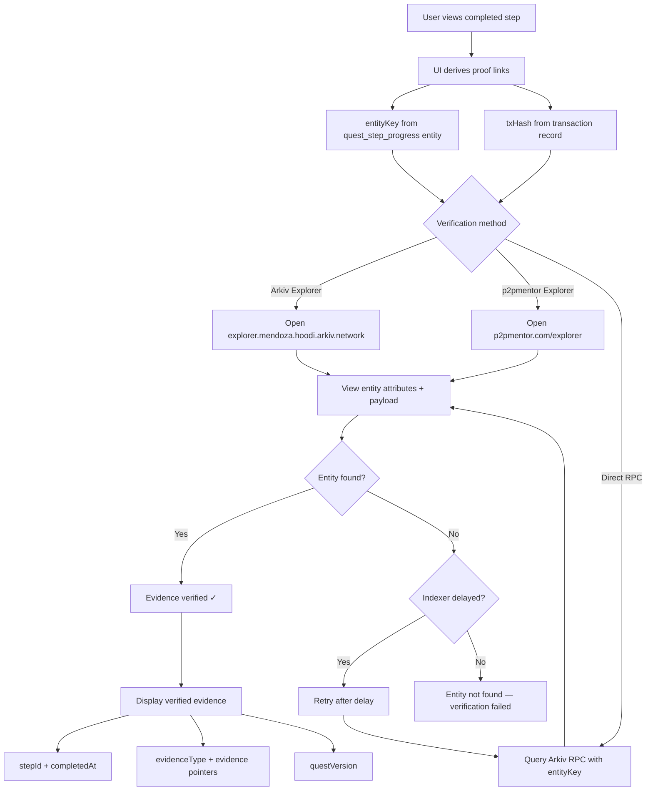

# Evidence Verification Flow

## Overview

This document describes how quest step evidence is verified without trusting p2pmentor servers. Evidence is stored as Arkiv entities and can be independently verified via Arkiv Explorer or direct RPC queries.

## Flow Diagram

## Verification Without p2pmentor Servers

Evidence verification does not depend on p2pmentor API routes. The verification path is:

1. **Get entityKey or txHash** from the `quest_step_progress` entity stored on Arkiv
2. **Open Arkiv Explorer** at `https://explorer.mendoza.hoodi.arkiv.network`
3. **Search by entityKey** to view the entity's attributes and payload
4. **Confirm** that the entity contains the expected evidence structure

No login is required. No p2pmentor session is needed.

## Evidence Types and Verification

| Step Type | Evidence Type       | Verification Target                                                     |
| --------- | ------------------- | ----------------------------------------------------------------------- |
| READ      | `completion`        | `quest_step_progress` entity with `stepId` and `completedAt`            |
| DO        | `entity_created`    | `quest_step_progress` entity + referenced `entityKey` of created entity |
| QUIZ      | `quiz_result`       | `quest_step_progress` entity + `learner_quest_assessment_result` entity |
| SUBMIT    | `submission`        | `quest_step_progress` entity with `submittedValue`                      |
| SESSION   | `session_completed` | `quest_step_progress` entity + referenced `sessionEntityKey`            |
| VERIFY    | `query_proof`       | `quest_step_progress` entity with `queryFingerprint` and `resultKeys`   |

## When p2pmentor API is Down

If p2pmentor API routes are unreachable:

1. Evidence already stored on Arkiv remains independently verifiable
2. Users can open Arkiv Explorer links directly
3. Entity keys and transaction hashes are self-contained proof references
4. The UI displays a message: "Verification available via Arkiv Explorer"

## UI Components

- `components/ViewOnArkivLink.tsx` — generates Arkiv Explorer links from entityKey or txHash
- `components/quests/EvidencePanel.tsx` — displays evidence items with type badges and verification links
- `lib/arkiv/explorer.ts` — constructs Arkiv Explorer URLs

## Related Patterns

- [PAT-REF-001: Relationship References That Survive Updates](../patterns/reference-integrity.md)
- [PAT-QUERY-001: Indexer-Friendly Query Shapes](../patterns/query-optimization.md)
