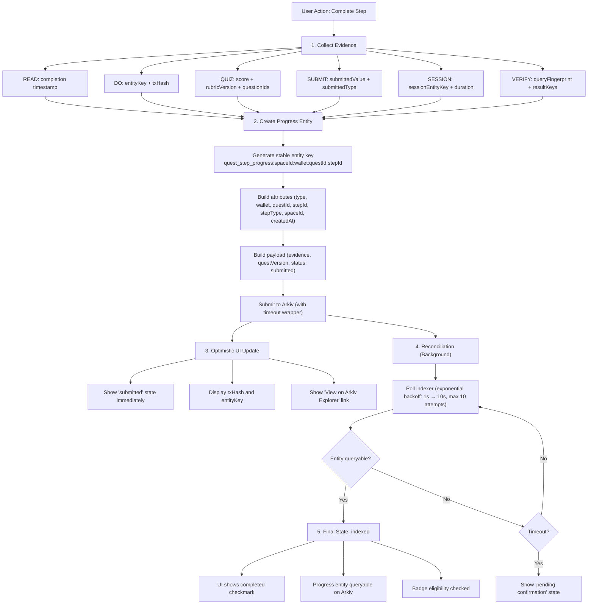

# Quest Completion Flow

## Overview

This document describes the complete flow from user action to evidence stored on Arkiv when completing a quest step. The flow handles indexer lag gracefully with optimistic UI updates and reconciliation.

## Flow Diagram



## Step-by-Step Flow

### Step 1: Evidence Collection

Evidence collection varies by step type:

**READ Steps:**

```typescript
const evidence = {
  stepId: 'intro',
  completedAt: new Date().toISOString(),
  evidenceType: 'completion',
  questVersion: '1',
};
```

**DO Steps:**

```typescript
const evidence = {
  stepId: 'first_entity',
  completedAt: new Date().toISOString(),
  evidenceType: 'entity_created',
  entityKey: 'hello_world:beta-launch:0xabc123',
  txHash: '0x...',
  questVersion: '1',
};
```

**QUIZ Steps:**

```typescript
const evidence = {
  stepId: 'quiz',
  completedAt: new Date().toISOString(),
  evidenceType: 'quiz_result',
  score: 4,
  maxScore: 5,
  rubricVersion: 'arkiv_basics_v1',
  questionIds: ['q1', 'q2', 'q3', 'q4', 'q5'],
  questVersion: '1',
};
```

### Step 2: Progress Entity Creation

```typescript
const result = await createQuestStepProgress({
  wallet: '0xabc123',
  questId: 'arkiv_builder',
  stepId: 'intro',
  stepType: 'READ',
  evidence: {
    /* ... */
  },
  questVersion: '1',
  privateKey: ARKIV_PRIVATE_KEY,
  spaceId: SPACE_ID,
});

// Returns:
// {
//   key: 'quest_step_progress:beta-launch:0xabc123:arkiv_builder:intro',
//   txHash: '0x...',
//   status: 'submitted'
// }
```

**Entity Key Generation:**

- Pattern B (stable key): `quest_step_progress:${spaceId}:${wallet}:${questId}:${stepId}`
- Deterministic: Same inputs always produce same key
- Enables reliable querying without query-first patterns

### Step 3: Optimistic UI Update

```typescript
// React hook manages optimistic state
const { recordProgress, pendingSteps } = useProgressReconciliation();

await recordProgress(stepId, evidence);

// UI immediately shows:
// - "Submitted" badge
// - Transaction hash (if available)
// - "View on Arkiv Explorer" link
// - Pending spinner
```

**UI States:**

- `pending` - User action, before API call
- `submitted` - Transaction confirmed, not yet queryable
- `indexed` - Entity queryable on Arkiv
- `error` - Transaction failed or timeout

### Step 4: Reconciliation

```typescript
// Poll indexer until entity is queryable
const pollForIndexer = async (txHash: string) => {
  let attempts = 0;
  const maxAttempts = 10;
  const backoffMs = 1000;

  while (attempts < maxAttempts) {
    await new Promise((resolve) => setTimeout(resolve, backoffMs * Math.pow(2, attempts)));

    const progress = await getQuestStepProgress({ wallet, questId, spaceId });
    const found = progress.find((p) => p.txHash === txHash);

    if (found) {
      return { status: 'indexed', progress: found };
    }

    attempts++;
  }

  return { status: 'timeout' };
};
```

**Reconciliation Behavior:**

- Exponential backoff: 1s, 2s, 4s, 8s, 16s, 30s (max)
- Max attempts: 10
- Timeout after ~5 minutes
- Graceful degradation: Show "pending confirmation" if timeout

### Step 5: Final State

Once entity is queryable:

- Status updates to "indexed"
- UI shows "completed" checkmark
- Progress counted toward quest completion
- Badge eligibility checked (if all required steps complete)

## Indexer Lag Handling

**States:**

1. **Pending:** User action, before API call
2. **Submitted:** Transaction confirmed, entity not yet queryable
3. **Indexed:** Entity queryable via indexer
4. **Timeout:** Max polling attempts reached, entity may still be pending

**Reconciliation Pattern:**

- Optimistic UI updates immediately
- Background polling checks indexer
- UI updates when entity becomes queryable
- Graceful timeout handling

**Implementation:**

- `lib/hooks/useProgressReconciliation.ts` - React hook for reconciliation
- `lib/arkiv/questProgress.ts` - Returns "submitted" status, caller handles reconciliation
- Exponential backoff polling until entity is indexed

## Error Handling

**Transaction Failures:**

- Network errors: Retry with backoff
- Validation errors: Show user-friendly error message
- Timeout errors: Show "pending confirmation" state

**Indexer Lag:**

- Entity may be confirmed but not yet queryable
- Polling continues until entity is found or timeout
- Graceful degradation: Show "pending" state

**Evidence Validation:**

- Validate evidence structure before creating entity
- Check required fields per step type
- Return validation errors before transaction submission

## Files Referenced

- `lib/arkiv/questProgress.ts` - Progress entity creation
- `lib/arkiv/questStep.ts` - Evidence validation and creation
- `lib/hooks/useProgressReconciliation.ts` - Optimistic UI reconciliation
- `app/api/quests/progress/route.ts` - API route for progress operations
- `components/QuestStepRenderer.tsx` - UI component for step completion

## Related Patterns

- [PAT-OPTIMISTIC-001: Optimistic UI + Reconciliation](../patterns/optimistic-ui-reconciliation.md)
- [PAT-INDEXER-001: Read-Your-Writes Under Indexer Lag](../patterns/indexer-lag-handling.md)
- [PAT-UPDATE-001: Stable Entity Key Updates](../patterns/stable-entity-key-updates.md)
