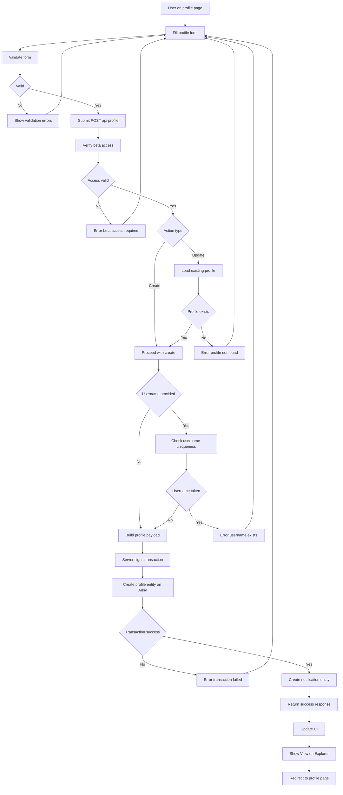

# Profile Creation Flow

Technical documentation of the profile creation and update flow.

## Conceptual Flow Diagram

Pre-implementation conceptual diagram of the profile creation flow.

View Mermaid source code

## Implementation Flow Diagram

Current implementation diagram of the profile creation and update flow.

View Mermaid source code

## Implementation Details

### Key Implementation Points

1. **Always Server-Side**: Profile creation always uses the API route (`POST /api/profile`), which uses the server's private key (`ARKIV_PRIVATE_KEY`) to sign transactions. No client-side MetaMask signing for profiles.

2. **Beta Access Check**: First step in API route is to verify beta access via `verifyBetaAccess()`.

3. **Profile Existence Check**: 
   - For `updateProfile`: Checks if profile exists first, returns 404 if not found
   - For `createProfile`: No existence check (allows creating new profile)

4. **Username Uniqueness**: 
   - Only checked if username is provided
   - Uses `checkUsernameExists()` which queries all profiles with that username
   - Filters out profiles from the same wallet (user can reuse their own username)
   - Returns 409 Conflict with `canRegrow: true` if duplicate found

5. **Update Flow**: 
   - Updates create new entities (immutable pattern)
   - Merges new data with existing profile data
   - Preserves fields not provided in update

6. **Average Rating Calculation**: 
   - For updates: Fetches existing profile and recalculates `avgRating` from all feedback
   - For new profiles: Sets `avgRating` to 0

7. **Identity Seed**: 
   - Uses provided `identity_seed` if given
   - For updates: Preserves existing `identity_seed` if not provided
   - For new profiles: Auto-generates random emoji if not provided

8. **Transaction Handling**: 
   - Wrapped in `handleTransactionWithTimeout()` for timeout handling
   - Handles rate limit errors (429 status)
   - Handles transaction timeout (returns `pending: true`)
   - Other errors return 500 status

9. **Notification Creation**: 
   - Always creates notification entity after successful profile creation
   - Notification type: `entity_created`
   - Source entity type: `user_profile`
   - Links to `/me/profile`

10. **Frontend Handling**: 
    - Checks for `pending: true` in response
    - Shows appropriate message for pending transactions
    - Reloads profile after success
    - Handles username duplicate errors with regrow option

## Files Referenced

- `app/api/profile/route.ts` - API route handler
- `app/me/profile/page.tsx` - Profile form UI and submission
- `lib/arkiv/profile.ts` - Profile creation functions (`createUserProfile`, `checkUsernameExists`, `getProfileByWallet`)
- `lib/arkiv/transaction-utils.ts` - `handleTransactionWithTimeout` wrapper
- `lib/arkiv/notifications.ts` - Notification creation

