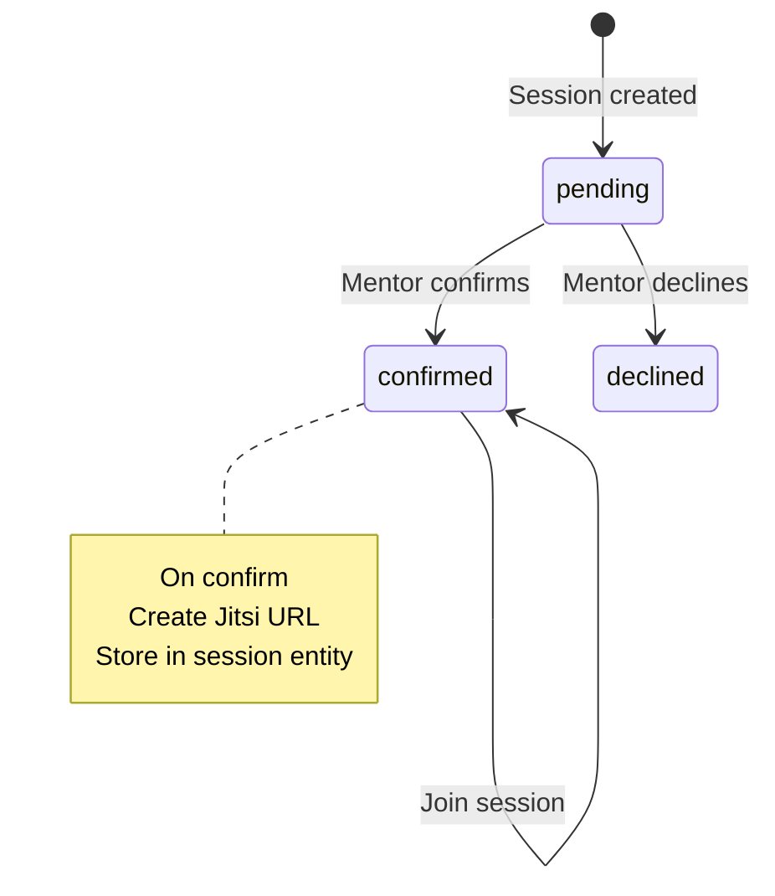
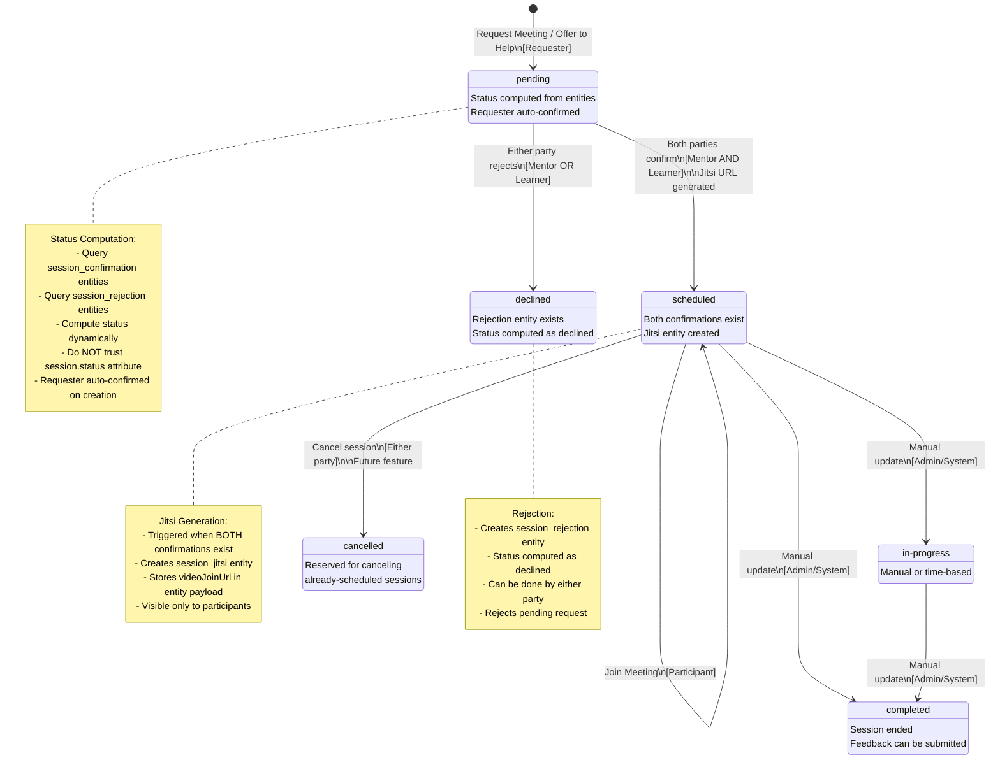

# Session State Machine

Technical documentation of session state transitions and workflow.

## Conceptual State Machine Diagram

Pre-implementation conceptual diagram of the session state machine.


<details>
<summary>View Mermaid source code</summary>



</details>

## Implementation State Machine Diagram

Current implementation diagram of session state transitions.


<details>
<summary>View Mermaid source code</summary>



</details>

## Implementation Details

### Key Implementation Points

1. **Status is Computed, Not Stored**: The session entity has a `status` attribute, but the actual status is computed dynamically from supporting entities (`session_confirmation`, `session_rejection`). The code explicitly states: "Don't trust the entity's status attribute - recalculate based on confirmations."

2. **Auto-Confirmation of Requester**: When a session is created, the requester is automatically confirmed by creating a `session_confirmation` entity for them. This means:
   - If learner requests from offer: learner is auto-confirmed
   - If mentor offers to help on ask: mentor is auto-confirmed
   - Only the other party needs to confirm

3. **Both Parties Must Confirm**: Status transitions from `pending` to `scheduled` only when BOTH parties have `session_confirmation` entities. This is checked in the `confirmSession` function.

4. **Jitsi Generation Timing**: The Jitsi meeting URL is generated when BOTH parties confirm (not on first confirmation). The `confirmSession` function checks if both confirmations exist, and only then creates the `session_jitsi` entity.

5. **Rejection Creates Entity**: Rejection doesn't update the session entity directly. Instead, it creates a `session_rejection` entity, and the status is computed as `declined` when this entity exists.

6. **Supporting Entities**:
   - `session_confirmation`: Links to session via `sessionKey`, contains `confirmedBy` (mentorWallet or learnerWallet)
   - `session_rejection`: Links to session via `sessionKey`, contains `rejectedBy` (mentorWallet or learnerWallet)
   - `session_jitsi`: Links to session via `sessionKey`, contains `videoJoinUrl` in payload
   - `session_txhash`: Tracks transaction hash for session creation (separate entity)

7. **Status Computation Logic** (from `listSessions`):
   ```typescript
   if (mentorRejected || learnerRejected) {
     finalStatus = 'declined';
   } else if (mentorConfirmed && learnerConfirmed) {
     // Both confirmed - mark as scheduled only if currently pending
     // Preserve 'completed' and 'in-progress' statuses (don't overwrite)
     if (entityStatus === 'pending') {
       finalStatus = 'scheduled';
     } else if (entityStatus === 'completed' || entityStatus === 'in-progress') {
       // Preserve completed/in-progress status
       finalStatus = entityStatus;
     } else {
       // For scheduled or other statuses, ensure it's scheduled
       finalStatus = 'scheduled';
     }
   } else if (entityStatus === 'scheduled' && (!mentorConfirmed || !learnerConfirmed)) {
     finalStatus = 'pending'; // Revert if status doesn't match confirmations
   }
   ```
   
   **Critical Fix**: The status computation now preserves `'completed'` and `'in-progress'` statuses when both parties have confirmed. Previously, these statuses were being overwritten to `'scheduled'`, causing completed sessions to disappear from profile stats, notifications, and past filters.

8. **Future States**: 
   - `in-progress`: Manual status update (future feature)
   - `completed`: Manual status update after session ends
   - `cancelled`: Reserved for canceling already-scheduled sessions (not yet implemented)

9. **Expiration**: Session entities expire at `sessionDate + duration + 1 hour buffer`. Supporting entities (confirmations, rejections, Jitsi) use the same expiration.

10. **Payment Flow** (not shown in diagram):
    - `session_payment_submission`: Created when learner submits payment txHash
    - `session_payment_validation`: Created when mentor validates payment
    - These are separate entities linked via `sessionKey`

## Files Referenced

- `lib/arkiv/sessions.ts` - Session creation, confirmation, rejection, and status computation
- `app/api/sessions/route.ts` - API route for session operations
- `app/me/sessions/page.tsx` - Frontend UI for viewing and managing sessions
- `components/RequestMeetingModal.tsx` - Modal for requesting meetings
- `docs/betadocs/arkiv/session.md` - Session entity documentation

## M1 Acceptance Criteria Compliance

- ✅ **States**: `pending`, `scheduled` (confirmed), `declined` (rejected) are implemented
- ✅ **Jitsi URL**: Generated on confirmation (when both parties confirm) and stored in `session_jitsi` entity
- ✅ **Status Computation**: Status is computed from supporting entities, not stored directly
- ✅ **Entity Structure**: Uses separate entities (`session_confirmation`, `session_rejection`, `session_jitsi`) linked via `sessionKey`

