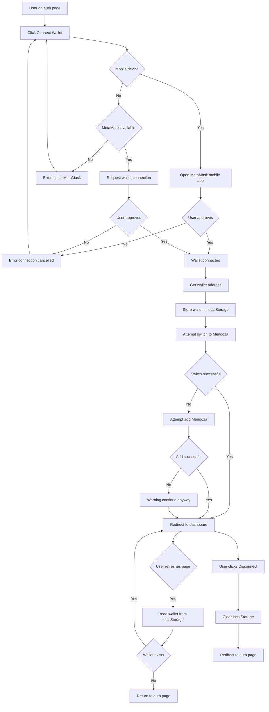

# Wallet Authentication Flow

Technical documentation of the MetaMask wallet authentication flow.

## Conceptual Flow Diagram

Pre-implementation conceptual diagram of the wallet authentication flow.

View Mermaid source code

## Implementation Flow Diagram

Current implementation diagram of the MetaMask wallet authentication flow.

```mermaid
flowchart TD
  %% =========================
  %% M1 Wallet Authentication Flow
  %% Based on actual implementation
  %% =========================

  A([User on /auth page])
  B([Click Connect Wallet])

  A --> B

  B --> C{Mobile browser detected}
  C -- Yes --> C1{MetaMask browser?}
  C1 -- Yes --> D1[Use window.ethereum directly]
  C1 -- No --> M1[Redirect to MetaMask universal link]
  M1 --> M2[Open MetaMask app via link.metamask.io/dapp/]
  M2 --> M3{User approves in MetaMask app}
  M3 -- No --> E1[[Error: Connection cancelled]]
  E1 --> B
  M3 -- Yes --> M4[Return to browser with connection]
  M4 --> D1

  C -- No --> D2{SDK available?}
  D2 -- Yes --> S1[Try SDK connection first]
  S1 --> S2[connectWithSDK via MetaMaskSDK]
  S2 --> S3{SDK connection succeeds?}
  S3 -- Yes --> S4[Switch to Mendoza chain]
  S4 --> D
  S3 -- No --> S5{User cancelled?}
  S5 -- Yes --> E1
  S5 -- No --> D2F[Fallback to window.ethereum]

  D2 -- No --> D3{window.ethereum exists?}
  D2F --> D3
  D3 -- No --> E2[[Error: No wallet provider found]]
  E2 --> B
  D3 -- Yes --> D4[Check localStorage for stored wallet]
  D4 --> D5{Stored wallet exists?}
  D5 -- No --> D6[Revoke permissions wallet_revokePermissions]
  D6 --> D7[Request permissions wallet_requestPermissions]
  D7 --> D8{User approves?}
  D8 -- No --> E1
  D8 -- Yes --> D9[Request accounts eth_requestAccounts]
  D5 -- Yes --> D9[Request accounts eth_requestAccounts - skip permissions]

  D1 --> D10[Switch to Mendoza chain]
  D10 --> D11{Chain switch succeeds?}
  D11 -- No --> D12[Try wallet_addEthereumChain if error 4902]
  D12 --> D13{Network added?}
  D13 -- No --> W1[[Warning: Chain switch failed - non-critical]]
  D13 -- Yes --> D
  D11 -- Yes --> D

  D9 --> D14{Accounts returned?}
  D14 -- No --> E4[[Error: No accounts returned]]
  E4 --> B
  D14 -- Yes --> D15[Switch to Mendoza chain]
  D15 --> D16{Chain switch succeeds?}
  D16 -- No --> D17[Try wallet_addEthereumChain if error 4902]
  D17 --> D18{Network added?}
  D18 -- No --> W2[[Warning: Chain switch failed - non-critical]]
  D18 -- Yes --> D
  D16 -- Yes --> D

  %% Wallet connected
  D --> E[Store wallet_address in localStorage]
  E --> E2[Store wallet_connection_method: metamask]
  E2 --> E3[Store wallet_type with address key: metamask]
  E3 --> F[Calculate onboarding level]

  %% Redirect logic
  F --> F1{Onboarding level === 0?}
  F1 -- Yes --> F2[Create beta access record async]
  F2 --> F3[Redirect to /onboarding]
  F1 -- No --> F4[Redirect to /me dashboard]

  %% Network add (optional, separate flow)
  F3 --> N[User on Dashboard]
  F4 --> N
  N --> N1{User clicks Add Network button?}
  N1 -- Yes --> N2[wallet_addEthereumChain Mendoza]
  N2 --> N3{Approved?}
  N3 -- No --> W3[[Warning: Network not added - user cancelled]]
  N3 -- Yes --> N4[Network added to wallet]
  N1 -- No --> G[Continue using app]

  %% Persist on refresh
  G --> R[Page refresh]
  R --> R1[Read wallet_address from localStorage]
  R1 --> R2{Wallet present?}
  R2 -- No --> R3[Stay on /auth or redirect to /beta]
  R2 -- Yes --> R4[Check wallet_connection_method]
  R4 --> R5{Method === 'metamask'?}
  R5 -- Yes --> R6[Check window.ethereum exists]
  R6 -- Yes --> G
  R6 -- No --> R7[[Warning: MetaMask not available - stay on page]]
  R5 -- No --> G

  %% Disconnect/Logout
  G --> X[User clicks Logout/Disconnect]
  X --> X1{Wallet type === 'metamask'?}
  X1 -- Yes --> X2[Call disconnectWallet wallet_revokePermissions]
  X2 --> X3{Revoke succeeds?}
  X3 -- No --> X4[[Warning: Could not revoke - continue anyway]]
  X3 -- Yes --> X5[Clear localStorage]
  X1 -- No --> X5[Clear localStorage wallet_address]
  X5 --> X6[Clear wallet_type with address key]
  X6 --> X7[Clear wallet_connection_method]
  X7 --> X8[Clear all passkey keys]
  X8 --> X9[Redirect to /auth]

  %% =========================
  %% Styling
  %% =========================
  classDef user fill:#FFE08A,stroke:#B58900,color:#000;
  classDef wallet fill:#BFD7FF,stroke:#1D4ED8,color:#000;
  classDef storage fill:#A7D8FF,stroke:#0369A1,color:#000;
  classDef decision fill:#E5E7EB,stroke:#374151,color:#000;
  classDef error fill:#FCA5A5,stroke:#B91C1C,color:#000;
  classDef warn fill:#FDE68A,stroke:#B45309,color:#000;
  classDef nav fill:#C7F9CC,stroke:#16A34A,color:#000;
  classDef sdk fill:#E0E7FF,stroke:#4F46E5,color:#000;

  class A,B,N,X user
  class C,C1,D2,D3,D5,D8,D11,D13,D14,D16,D18,F1,N1,N3,R2,R5,R6,X1,X3 decision
  class D1,D2F,D4,D6,D7,D9,D10,D15,D17,S1,S2,S4,N2,X2 wallet
  class E,E2,E3,R1,R4 storage
  class E1,E2,E4 error
  class W1,W2,W3,R7,X4 warn
  class F3,F4,G,X9 nav
  class S1,S2,S3,S4,S5 sdk
```

View Mermaid source code

## Implementation Details

### Key Implementation Points

1. **SDK First Approach**: The implementation tries MetaMask SDK first (if available), then falls back to direct `window.ethereum` connection.

2. **Mobile Detection**: Uses `isMobileBrowser()` and `isMetaMaskBrowser()` to determine connection path before attempting connection.

3. **Mobile Redirect**: On mobile (non-MetaMask browser), redirects to `https://link.metamask.io/dapp/{host}{path}` universal link instead of using SDK deep linking.

4. **Permission Management**: 
   - Fresh login: Revokes permissions first (`wallet_revokePermissions`), then requests (`wallet_requestPermissions`)
   - Reconnection: Skips permission request, goes directly to `eth_requestAccounts`

5. **Chain Switching**: Happens AFTER connection, not before. Uses `wallet_switchEthereumChain` first, falls back to `wallet_addEthereumChain` if chain doesn't exist (error 4902).

6. **Network Add Button**: Separate optional flow on auth page - user can manually add Mendoza network before connecting.

7. **Onboarding Redirect**: Redirects to `/onboarding` for new users (level 0), `/me` for existing users (level > 0).

8. **Beta Access Record**: Created asynchronously for new users only (level 0) to avoid double-counting.

9. **Disconnect Flow**: Revokes permissions via `wallet_revokePermissions`, then clears all localStorage keys including `wallet_address`, `wallet_type_{address}` (dynamic key with wallet address), `wallet_connection_method`, and all `passkey_*` keys.

10. **Error Handling**: Distinguishes between user cancellation (4001), missing provider, and other errors with appropriate messages.

## Files Referenced

- `lib/auth/metamask.ts` - Core connection logic
- `lib/auth/metamask-sdk.ts` - SDK wrapper
- `lib/auth/mobile-detection.ts` - Mobile browser detection
- `lib/auth/deep-link.ts` - Universal link construction
- `app/auth/page.tsx` - Auth page UI and flow orchestration
- `components/navigation/SidebarNav.tsx` - Logout handler
- `components/navigation/BottomNav.tsx` - Logout handler

